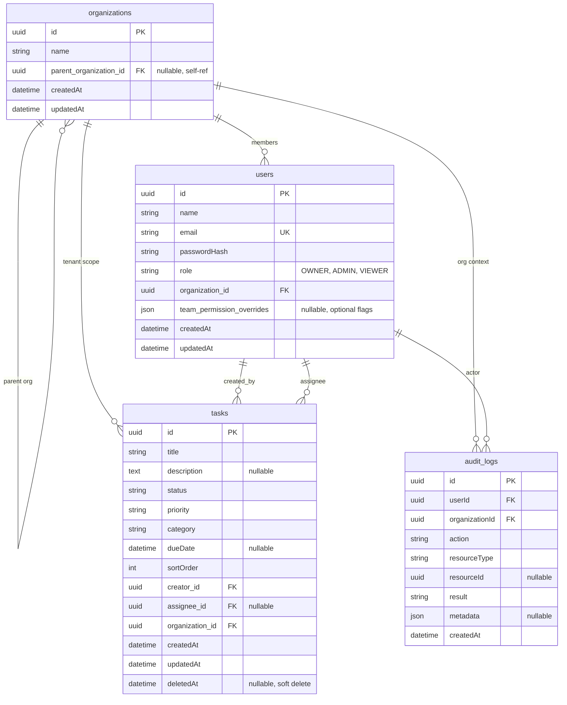

# Secure task management (Nx monorepo)

NX workspace implementing the **Full Stack Coding Challenge: Secure Task Management System** — NestJS + TypeORM + SQLite API, Angular + Tailwind dashboard, shared DTOs/RBAC helpers, JWT auth, and audit logging.

**Why Nx:** One repo keeps the Angular client, Nest API, and shared TypeScript contracts in sync (single version of enums, JWT payload shape, and permission helpers) and lets CI run targeted builds/tests per project.

## Layout

| Path | Purpose |
|------|---------|
| `apps/api` | NestJS backend (`/api` prefix); feature modules (auth, tasks, users, organizations, audit-log) wired in `AppModule`. |
| `apps/dashboard` | Angular + Tailwind SPA; routes, interceptors, and feature components. |
| `libs/data` | Shared enums and interfaces (tasks, users, orgs, audit views, team-permission helpers) consumed by API and dashboard. |
| `libs/auth` | Shared RBAC decorators (`@Public()`, `@Roles()`), JWT payload types, and `RequestUser` — Nest guards and Angular auth both align on the same contract. |

## Setup

1. **Install**

   ```bash
   npm install
   ```

2. **Environment**

   Copy `.env.example` to `.env` and adjust values. The API reads these at startup:

   | Variable | Purpose |
   |----------|---------|
   | `JWT_SECRET` | **Required.** Secret for signing access tokens (use a long random string in production). |
   | `JWT_EXPIRES_SEC` | Access token lifetime in **seconds** (must be numeric; invalid values break login). Default in example: `28800` (8h). |
   | `DB_PATH` | SQLite file path (default `data/taskmgmt.sqlite`, relative to repo root or absolute). |
   | `PORT` | API listen port (default `3000`). |
   | `CORS_ORIGIN` | Comma-separated allowed browser origins (e.g. `http://localhost:4200`). |

   ```bash
   cp .env.example .env
   ```

3. **Run API** (from repo root)

   ```bash
   npx nx run api:serve
   ```

   SQLite is created at `DB_PATH` (default `data/taskmgmt.sqlite`) on first run. **Demo orgs and users are ensured on every API start** (missing emails are inserted; existing rows are left as-is). **Demo tasks** are only inserted when the task table is empty—delete the DB file if you want to reset tasks.

4. **Run dashboard** (proxies `/api` → `http://localhost:3000`)

   ```bash
   npx nx run dashboard:serve
   ```

   Keep **both** the API (step 3) and the dashboard (step 4) running: sign-in calls `POST /api/auth/login`, which the dev server forwards to `http://localhost:3000`. If nothing is listening there, the proxy can surface errors (e.g. **500** in the browser network tab).

   **One terminal (API + dashboard):** `npm run serve:dev` starts both in parallel.

   Open `http://localhost:4200`. Log in with (all passwords **`password123`**). Demo display names are **Owner 1–3**, **Admin 1–3**, and **Viewer 1–3** (Acme → Engineering → Marketing per org above).

   **Login returns 500 (recurring):** In the dashboard terminal, look for **`http proxy error`** and **`ECONNREFUSED`**. That means the **API is not running** (or not on port **3000**). Start **`npx nx run api:serve`** in another terminal—or use **`npm run serve:dev`**—and wait until you see the Nest “Application is running” log before logging in. If the API *is* up, check the **API** terminal for stack traces; then verify **`JWT_SECRET`** is set and **`JWT_EXPIRES_SEC`** is numeric in `.env`.

   **Acme Corp** (parent org): `owner.acme@demo.local`, `admin.acme@demo.local`, `viewer.acme@demo.local`

   **Engineering** (child): `owner@demo.local`, `admin@demo.local`, `viewer@demo.local`

   **Marketing** (child): `owner.marketing@demo.local`, `admin.marketing@demo.local`, `viewer.marketing@demo.local`

## Architecture

- **Multi-tenant scope**: Every task and user row carries `organizationId`. The JWT carries the user’s `organizationId` from login.
- **Org hierarchy**: `Organization` self-references `parent` / `children` (seed: **Acme Corp** plus children **Engineering** and **Marketing**).
- **Visibility rollup (Owners only)**: **Owner** role sees tasks, audit logs, assignee options, and **Team** tree across **their org and all descendant orgs**. **Admin** and **Viewer** stay scoped to **their org node only**. **`PATCH /users/:id/role`**: Owner may promote/demote **Admin ↔ Viewer** for any user in that subtree (not other Owners); **Team** tab renders parent → child orgs as a **tree**.
- **RBAC**
  - **Owner / Admin**: Full task CRUD within org; can verify (`VERIFIED`); can open audit log.
  - **Viewer**: Read all tasks in org; may **update only assigned tasks**, and only `status` / `sortOrder`, with transitions **Open → In Progress → Done** (no verify).
  - **Role inheritance in guards**: Owner satisfies `@Roles(ADMIN)` via rank (Owner ≥ Admin ≥ Viewer).
- **JWT**: `Authorization: Bearer <token>` on protected routes; `POST /api/auth/login` is public.

## Data model (summary)

- **Organization** — id, name, optional parent, timestamps.
- **User** — id, name, email, `passwordHash`, `role`, `organizationId`, optional `team_permission_overrides` (JSON checklist for Team UI; see Future work).
- **Task** — title, description, `status`, `priority`, `category`, optional `dueDate`, `sortOrder`, `creatorId`, optional `assigneeId`, `organizationId`, soft-delete `deletedAt`.
- **AuditLog** — who, org, action, resource type/id, result, optional JSON metadata, timestamp.

**ER diagram** (tables match TypeORM entities; rendered on GitHub / many Markdown viewers):



| Relationship | Meaning |
|--------------|--------|
| **organizations → organizations** | Optional parent; org tree (e.g. Acme → Engineering / Marketing). |
| **organizations → users** | Each user belongs to one org. |
| **organizations → tasks** | Tasks are scoped to one org. |
| **users → tasks** | Required **creator**; optional **assignee**. |
| **users / organizations → audit_logs** | **Actor** (`userId`) and **org** (`organizationId`) for each audit row. |

*Note: SQLite physical columns follow TypeORM `synchronize`; some tables may include legacy duplicate FK columns from earlier mappings—the diagram reflects the intended logical model.*

## API (base URL `/api`)

| Method | Path | Notes |
|--------|------|--------|
| POST | `/auth/login` | Body `{ "email", "password" }` → `{ access_token, user }` |
| GET | `/auth/me` | Current user profile |
| POST | `/tasks` | Admin/Owner — create task |
| GET | `/tasks` | List tasks in org; optional `?status=&category=` |
| GET | `/tasks/:id` | Single task in org |
| PUT | `/tasks/:id` | Update; Viewer rules enforced in service |
| DELETE | `/tasks/:id` | Admin/Owner — soft delete |
| GET | `/audit-log` | Admin/Owner — recent entries for org |
| GET | `/users` | Authenticated — members in visible org scope (assignee labels & pickers; Viewer sees own org only) |
| GET | `/organizations` | Admin/Owner — org nodes in visible scope (`id`, `name`, `parentOrganizationId`) for hierarchy UI |
| PATCH | `/users/:id/role` | **Owner only** — body `{ "role": "ADMIN" \| "VIEWER" }`; target user must be in Owner’s visible org subtree |
| PATCH | `/users/:id/team-permissions` | **Owner only** — body `{ "permissions": { "viewTasks": true, … } }`; values clamped to target role; see Future work |

### Example: login

**Request**

```bash
curl -s -X POST http://localhost:3000/api/auth/login \
  -H 'Content-Type: application/json' \
  -d '{"email":"admin@demo.local","password":"password123"}'
```

**Response** (shape; `access_token` is a JWT)

```json
{
  "access_token": "<jwt>",
  "user": {
    "id": "…",
    "name": "…",
    "email": "admin@demo.local",
    "role": "ADMIN",
    "organizationId": "…"
  }
}
```

### Example: list tasks

**Request**

```bash
curl -s http://localhost:3000/api/tasks \
  -H "Authorization: Bearer <access_token>"
```

**Response** (array of task DTOs; abbreviated)

```json
[
  {
    "id": "…",
    "title": "…",
    "description": null,
    "status": "OPEN",
    "priority": "MEDIUM",
    "category": "FEATURE",
    "dueDate": null,
    "sortOrder": 0,
    "creatorId": "…",
    "assigneeId": null,
    "organizationId": "…",
    "createdAt": "…",
    "updatedAt": "…"
  }
]
```

## Frontend

- Login stores JWT + user in `localStorage`; `authInterceptor` attaches `Authorization` to API calls.
- Dashboard: filter by category, **CDK drag-and-drop** between status columns (viewers are not connected to the Verified column), **Create / Edit** tasks with **assignee dropdown** (from `/api/users`), **Verify** and **Delete** for Admin/Owner, **Audit log** for elevated roles, **Team** tab for **Owner** — **tree** of orgs (from `/api/organizations` + `/api/users`) with promote/demote **Admin ↔ Viewer** per org.

## Tests

### Where the tests live

| Location | File(s) |
|----------|---------|
| **API (unit)** | `apps/api/src/app/auth/roles.guard.spec.ts` |
| **Data lib** | `libs/data/src/lib/enums.spec.ts` |
| **Auth lib** | `libs/auth/src/lib/auth.lib.spec.ts` |
| **Dashboard (unit)** | `apps/dashboard/src/app/app.spec.ts` |
| **API (e2e)** | `apps/api-e2e/src/api/api.spec.ts` |
| **Dashboard (e2e)** | `apps/dashboard-e2e/src/example.spec.ts` |

### What is being tested

- **`libs/data`** — Shared enum string values match the API contract (e.g. `UserRole.OWNER`, `TaskStatus.VERIFIED`).
- **`libs/auth`** — RBAC metadata key used by Nest (`ROLES_KEY`) is defined as expected.
- **`apps/api` — `RolesGuard`** — Access decisions: no `@Roles` → allow any authenticated user; `@Roles(ADMIN)` → **Owner** and **Admin** allowed, **Viewer** receives **403** (role rank / inheritance).
- **`apps/dashboard` — `App` root** — Root component **creates** under the test module (smoke / harness check).
- **`api-e2e`** — HTTP **`POST /api/auth/login`** with demo **Engineering** admin credentials returns **200**, a non-empty **`access_token`**, and **`user`** metadata (`email`, `role`, etc.). Requires the API to be **served** with a **seeded** SQLite DB (Nx uses `dependsOn: api:serve`).
- **`dashboard-e2e` (Playwright)** — Navigates to **`/`** (redirects to login when unauthenticated) and asserts the **login** heading is present (**smoke** for the SPA).

### Commands

**Unit / integration-style (Jest)**

```bash
npx nx run api:test
npx nx run data:test
npx nx run auth:test
npx nx run dashboard:test
```

**End-to-end**

```bash
npx nx run api-e2e:e2e
npx nx run dashboard-e2e:e2e
```

`dashboard-e2e:e2e` starts the dev server via Nx and runs Playwright; ensure browsers are installed (`npx playwright install` from repo root if needed).

### Future work

**Team permission matrix (Owner → Team tab)** — Owners can open each member row and edit a checklist of capabilities (view/create/edit/delete/verify/audit/team, etc.). Choices are **persisted** per user in `team_permission_overrides` (JSON) via `PATCH /api/users/:id/team-permissions`, clamped so flags never exceed what that user’s **role** allows; promote/demote clears overrides. **Authorization on task and audit routes still uses role only** — the matrix is documentation and demo UI until services load overrides (e.g. `effectiveTeamPermissions` from `libs/data`) alongside `UserRole` and gate each action consistently (and the dashboard mirrors the same rules so users do not hit unexpected 403s).

## Build

```bash
npx nx run api:build
npx nx run dashboard:build
```
