# Secure task management (Nx monorepo)

NX workspace implementing the **Full Stack Coding Challenge: Secure Task Management System** — NestJS + TypeORM + SQLite API, Angular + Tailwind dashboard, shared DTOs/RBAC helpers, JWT auth, and audit logging.

## Layout

| Path | Purpose |
|------|---------|
| `apps/api` | NestJS backend (`/api` prefix) |
| `apps/dashboard` | Angular + Tailwind SPA |
| `libs/data` | Shared enums and TypeScript interfaces |
| `libs/auth` | Shared RBAC metadata: `@Public()`, `@Roles()`, JWT payload types |

## Setup

1. **Install**

   ```bash
   npm install
   ```

2. **Environment**

   Copy `.env.example` to `.env` and set at least `JWT_SECRET`.

   ```bash
   cp .env.example .env
   ```

3. **Run API** (from repo root)

   ```bash
   npx nx run api:serve
   ```

   SQLite is created at `DB_PATH` (default `data/taskmgmt.sqlite`) on first run. **Demo orgs and users are ensured on every API start** (missing emails are inserted; existing rows are left as-is). **Demo tasks** are only inserted when the task table is empty—delete the DB file if you want to reset tasks.

4. **Run dashboard** (proxies `/api` → `http://localhost:3000`)

   ```bash
   npx nx run dashboard:serve
   ```

   Keep **both** the API (step 3) and the dashboard (step 4) running: sign-in calls `POST /api/auth/login`, which the dev server forwards to `http://localhost:3000`. If nothing is listening there, the proxy can surface errors (e.g. **500** in the browser network tab).

   Open `http://localhost:4200`. Log in with (all passwords **`password123`**). Demo display names are **Owner 1–3**, **Admin 1–3**, and **Viewer 1–3** (Acme → Engineering → Marketing per org above).

   **Login returns 500:** Confirm `npx nx run api:serve` is up and watch that terminal for errors. Use a numeric **`JWT_EXPIRES_SEC`** in `.env` (seconds); non-numeric values break JWT signing during login. **`JWT_SECRET`** must be set.

   **Acme Corp** (parent org): `owner.acme@demo.local`, `admin.acme@demo.local`, `viewer.acme@demo.local`

   **Engineering** (child): `owner@demo.local`, `admin@demo.local`, `viewer@demo.local`

   **Marketing** (child): `owner.marketing@demo.local`, `admin.marketing@demo.local`, `viewer.marketing@demo.local`

## Architecture

- **Multi-tenant scope**: Every task and user row carries `organizationId`. The JWT carries the user’s `organizationId` from login.
- **Org hierarchy**: `Organization` self-references `parent` / `children` (seed: **Acme Corp** plus children **Engineering** and **Marketing**).
- **Visibility rollup (Owners only)**: **Owner** role sees tasks, audit logs, assignee options, and **Team** tree across **their org and all descendant orgs**. **Admin** and **Viewer** stay scoped to **their org node only**. **`PATCH /users/:id/role`**: Owner may promote/demote **Admin ↔ Viewer** for any user in that subtree (not other Owners); **Team** tab renders parent → child orgs as a **tree**.
- **RBAC**
  - **Owner / Admin**: Full task CRUD within org; can verify (`VERIFIED`); can open audit log.
  - **Viewer**: Read all tasks in org; may **update only assigned tasks**, and only `status` / `sortOrder`, with transitions **Open → In Progress → Done** (no verify).
  - **Role inheritance in guards**: Owner satisfies `@Roles(ADMIN)` via rank (Owner ≥ Admin ≥ Viewer).
- **JWT**: `Authorization: Bearer <token>` on protected routes; `POST /api/auth/login` is public.

## Data model (summary)

- **Organization** — id, name, optional parent, timestamps.
- **User** — id, name, email, `passwordHash`, `role`, `organizationId`.
- **Task** — title, description, `status`, `priority`, `category`, optional `dueDate`, `sortOrder`, `creatorId`, optional `assigneeId`, `organizationId`, soft-delete `deletedAt`.
- **AuditLog** — who, org, action, resource type/id, result, optional JSON metadata, timestamp.

**ER diagram** (tables match TypeORM entities; rendered on GitHub / many Markdown viewers):

```mermaid
erDiagram
  organizations {
    uuid id PK
    string name
    uuid parent_organization_id FK "nullable, self-ref"
    datetime createdAt
    datetime updatedAt
  }

  users {
    uuid id PK
    string name
    string email UK
    string passwordHash
    string role "OWNER, ADMIN, VIEWER"
    uuid organization_id FK
    datetime createdAt
    datetime updatedAt
  }

  tasks {
    uuid id PK
    string title
    text description "nullable"
    string status
    string priority
    string category
    datetime dueDate "nullable"
    int sortOrder
    uuid creator_id FK
    uuid assignee_id FK "nullable"
    uuid organization_id FK
    datetime createdAt
    datetime updatedAt
    datetime deletedAt "nullable, soft delete"
  }

  audit_logs {
    uuid id PK
    uuid userId FK
    uuid organizationId FK
    string action
    string resourceType
    uuid resourceId "nullable"
    string result
    json metadata "nullable"
    datetime createdAt
  }

  organizations ||--o{ organizations : "parent org"

  organizations ||--o{ users : "members"
  organizations ||--o{ tasks : "tenant scope"
  organizations ||--o{ audit_logs : "org context"

  users ||--o{ tasks : "created_by"
  users ||--o{ tasks : "assignee"
  users ||--o{ audit_logs : "actor"
```



| Relationship | Meaning |
|--------------|--------|
| **organizations → organizations** | Optional parent; org tree (e.g. Acme → Engineering / Marketing). |
| **organizations → users** | Each user belongs to one org. |
| **organizations → tasks** | Tasks are scoped to one org. |
| **users → tasks** | Required **creator**; optional **assignee**. |
| **users / organizations → audit_logs** | **Actor** (`userId`) and **org** (`organizationId`) for each audit row. |

*Note: SQLite physical columns follow TypeORM `synchronize`; some tables may include legacy duplicate FK columns from earlier mappings—the diagram reflects the intended logical model.*

## API (base URL `/api`)

| Method | Path | Notes |
|--------|------|--------|
| POST | `/auth/login` | Body `{ "email", "password" }` → `{ access_token, user }` |
| GET | `/auth/me` | Current user profile |
| POST | `/tasks` | Admin/Owner — create task |
| GET | `/tasks` | List tasks in org; optional `?status=&category=` |
| GET | `/tasks/:id` | Single task in org |
| PUT | `/tasks/:id` | Update; Viewer rules enforced in service |
| DELETE | `/tasks/:id` | Admin/Owner — soft delete |
| GET | `/audit-log` | Admin/Owner — recent entries for org |
| GET | `/users` | Admin/Owner — members in visible org scope (assignee picker) |
| GET | `/organizations` | Admin/Owner — org nodes in visible scope (`id`, `name`, `parentOrganizationId`) for hierarchy UI |
| PATCH | `/users/:id/role` | **Owner only** — body `{ "role": "ADMIN" \| "VIEWER" }`; target user must be in Owner’s visible org subtree |

### Example: login

```bash
curl -s -X POST http://localhost:3000/api/auth/login \
  -H 'Content-Type: application/json' \
  -d '{"email":"admin@demo.local","password":"password123"}'
```

### Example: list tasks

```bash
curl -s http://localhost:3000/api/tasks \
  -H "Authorization: Bearer <access_token>"
```

## Frontend

- Login stores JWT + user in `localStorage`; `authInterceptor` attaches `Authorization` to API calls.
- Dashboard: filter by category, **CDK drag-and-drop** between status columns (viewers are not connected to the Verified column), **Create / Edit** tasks with **assignee dropdown** (from `/api/users`), **Verify** and **Delete** for Admin/Owner, **Audit log** for elevated roles, **Team** tab for **Owner** — **tree** of orgs (from `/api/organizations` + `/api/users`) with promote/demote **Admin ↔ Viewer** per org.

## Tests

```bash
npx nx run api:test
npx nx run data:test
npx nx run auth:test
npx nx run dashboard:test
```

## Tradeoffs / future work

- **TypeORM `synchronize: true`** — convenient for the assessment; use migrations in production.
- **No refresh tokens / CSRF** — document as future hardening (per brief).
- **Assignee on create** — UI asks for raw user UUID; a user picker would be nicer.
- **Repository naming** — submit using the employer’s naming convention if required (`<initial><lastname>-<uuid>`).

## Build

```bash
npx nx run api:build
npx nx run dashboard:build
```
